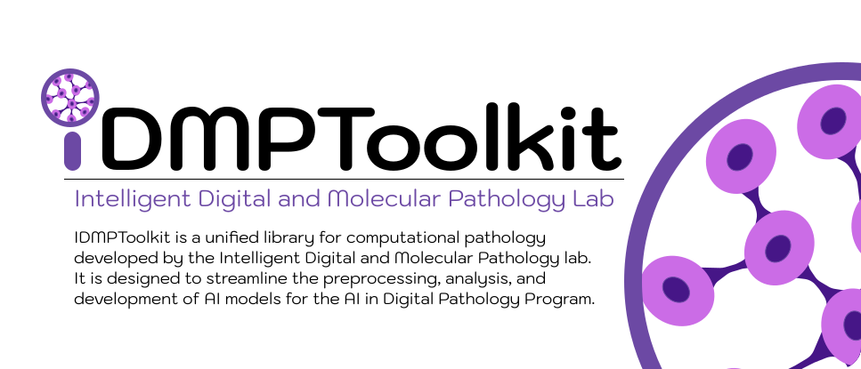

---
hide:
  - navigation
  - toc
---

# Welcome to **IDMPToolkit** :microscope:

  

-   :material-rocket-launch:{ .lg .middle } __Getting Started__

    ---

    Install the package and begin your workflow in minutes.

    [:octicons-arrow-right-24: Start here](getting_started.md)

-   :material-school:{ .lg .middle } __Tutorials__

    ---

    Step-by-step guides for patching, model usage, more.

    [:octicons-arrow-right-24: View tutorials](tutorials/index.md)

-   :material-puzzle:{ .lg .middle } __Modules__

    ---

    API reference for preprocess, segmentation, annotations, embeddings, and more.

    [:octicons-arrow-right-24: Explore modules](modules/index.md)

-   :simple-gitea:{ .lg .middle } __Contributing__

    ---

    Learn how to add functions, write docstrings, and submit PRs.

    [:octicons-arrow-right-24: Contribution guide](contributing.md)

-   :material-history:{ .lg .middle } __Changelog__

    ---

    Track what’s new in each release of the toolkit.

    [:octicons-arrow-right-24: View changelog](changelog.md)

-   :material-book-open-page-variant:{ .lg .middle } __References__

    ---

    Related research papers and background material.

    [:octicons-arrow-right-24: References](references.md)

